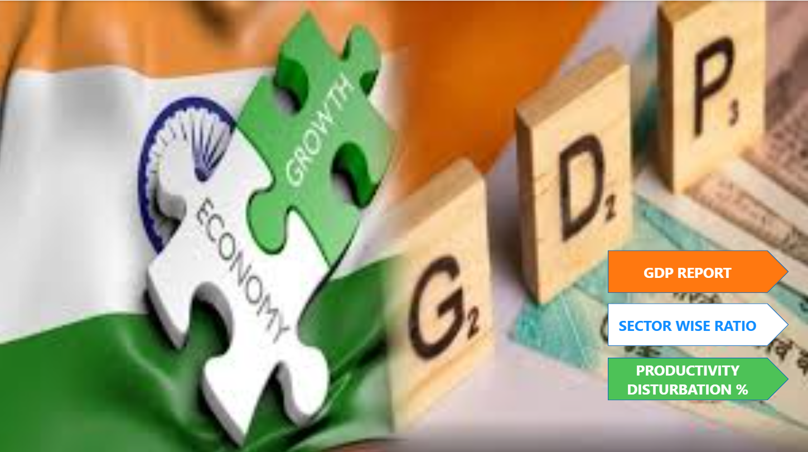
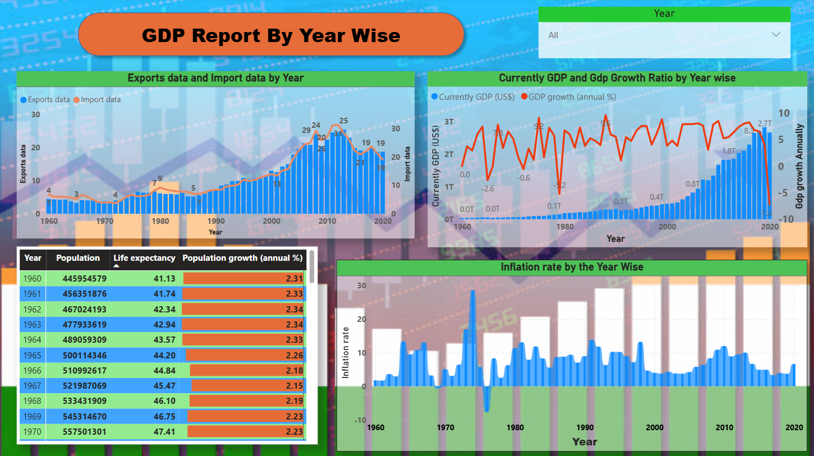
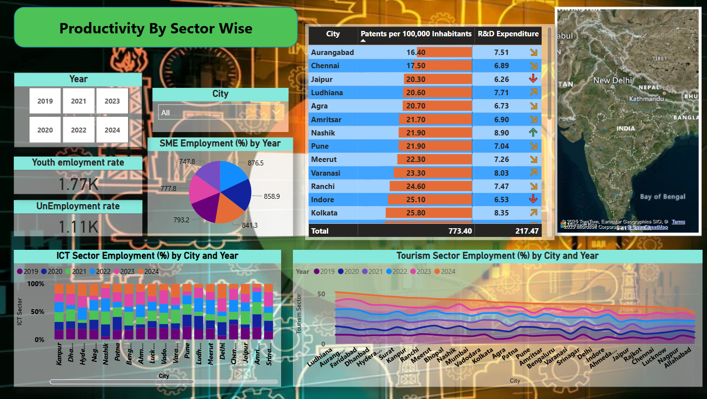

# 📊 Indian GDP Analysis (Power BI & Excel)

## 📌 Project Overview
This project analyzes the **Indian GDP growth trends** using data from various sources. It highlights GDP growth patterns, sectoral contributions, and overall economic performance.  

The project demonstrates skills in:
- Data cleaning (Excel, CSV)
- Data modeling & dashboarding (Power BI)
- Advanced calculations (DAX)

---

## 📂 Dataset
- **Source:** World Bank, IMF, Indian Govt. portals
- **Data Type:** Yearly GDP, Sectoral contributions
- **Formats:** Excel & CSV

---

## 🔧 Tools & Technologies
- Microsoft Excel
- Power BI
- DAX (Data Analysis Expressions)

---

## 🖼️ Dashboard Snapshots  

  
This is the **main overview dashboard** showing India’s GDP trends, key highlights, and summary KPIs.  

  
This snapshot highlights the **sectoral contributions to GDP**, such as Agriculture, Industry, and Services.  

  
This chart shows **GDP growth alongside export performance**, highlighting correlations between international trade and economic growth.  

  
This visualization explores **productivity metrics**, providing insights into how efficiency contributes to GDP growth.  

---

## 📈 Features
- Year-wise GDP growth analysis
- Sectoral GDP contribution (Agriculture, Industry, Services)
- Nominal vs Real GDP comparison
- CAGR & YoY Growth using DAX
- Interactive filters for year & sector

---

## 📌 Insights
- Services sector contributes the most to India’s GDP
- Agriculture’s contribution is declining gradually
- GDP growth shows dips during global crises
- Real GDP is more stable compared to Nominal GDP

---

## 🚀 How to Use
1. Clone the repository  
   ```bash
   git clone https://github.com/yourusername/indian-gdp-analysis.git
